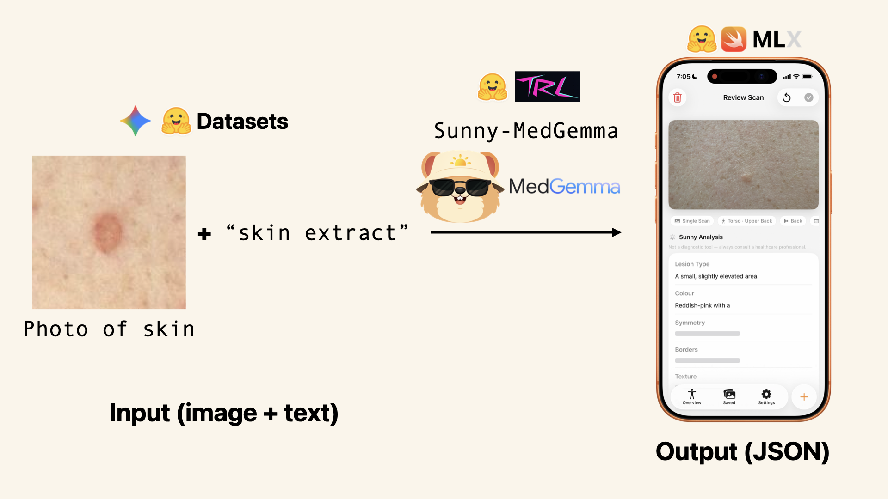

# Sunny - Skin Healthy Tracking App

Code and materials for Sunny, our entry into the [MedGemma Impact Challenge Kaggle competition](https://www.kaggle.com/competitions/med-gemma-impact-challenge), an app powered by MedGemma-1.5 to help with skin health tracking.

## Overview

Sunny's goal: Turn personal skin tracking from a vague intentional to an actionable habit.

Rather than create a pure diagnostic play (research is not strong here from smartphone cameras), Sunny aims to help people develop a tracking habit.

In essence our pitch is as much psychological as it is technological.

Sunny aims to fill the gap of a lacking nationwide screening solution in Australia.

The intention of Sunny is to encourage more people to self-skin examine on a regular (e.g. yearly) basis. This means potentially discovering skin cancers earlier resulting in earlier treatment and in turn saving on costs and improving mortality rates.



## TK - Resources

| Resource | Description | Link |
|----------|-------------|------|
| Sunny iOS TestFlight App | iOS app showcasing the use of the Sunny-MedGemma model running natively for helping extract information from skin and sunscreen photos. **Note:** All data is private and stays on the device Sunny is being used. | [Link](https://testflight.apple.com/join/HeCwNNGA) |
| TK - Writeup | Full writeup of project including problem definition, impact discussion and solution walkthrough. | TK |
| Video | 3 minute video overview of the Sunny project. | [Link](https://youtu.be/KVxzyWurDQQ) |
| Code | Full code and resources on GitHub. | [Link](https://github.com/mrdbourke/sunny) | 
| Sunny MedGemma Fine-Tuning Notebook | Notebook to fine-tune MedGemma to extract structured data from skin and sunscreen images. **Note:** Best viewed in Google Colab as GitHub rendering fails to show images. | [Link](https://github.com/mrdbourke/sunny/blob/main/sunny_MedGemma_fine_tuning.ipynb) |
| Sunny Dataset | Dataset for fine-tuning MedGemma for skin and sunscreen extraction. | [Link](https://huggingface.co/datasets/mrdbourke/sunny-skin-and-sunscreen-extract-1k) |
| Sunny-MedGemma-PyTorch | Fine-tuned MedGemma specifically for Sunny's use case of extracting data from skin and sunscreen images. | [Link](https://huggingface.co/mrdbourke/sunny-medgemma-1.5-4b-finetune) |
| Sunny-MedGemma-MLX | Fine-tuned MedGemma converted to MLX for deployment on iOS devices. | [Link](https://huggingface.co/mrdbourke/sunny-medgemma-1.5-4b-finetune-mlx-4bit) |

## MedGemma Integration

MedGemma integrates as a writer for generating descriptions of images. These could be reviewed by a patient or dermatologist for further inspection.

Crucially, MedGemma is not providing a diagnosis, more so acting as an informed scribe.

Extension: MedASR could later be integrated to allow voice-to-text notes for tracking or report discussing steps. For example, MedASR could transcribe a discussion between a patient and a dermatologist about their current review (the Review tab could have a voice recording feature which saves audio and attaches it to a particular review).

## Usage

### Notes

* **Prompt order matters** - The Sunny-MedGemma has been trained in the format `<image>` + `<text>` → `<text>`. The image must come **before** the text in the prompt. This goes for the PyTorch version of the model as well as the MLX verison of the model. Not using this order will likely result in undesirable outputs.
* **No hard negatives** - The model has been trained on sunscreen and skin images, however, it has not been trained on images to refuse. For example, if you upload a photo of a dog, the model will still produce an output. A future fine-tuning run would introduce hard negative samples to guide the model to know what kind of images to not predict anything on.

### Fine-tuning MedGemma

Please refer to the [fine-tuning notebook](https://github.com/mrdbourke/sunny/blob/main/sunny_MedGemma_fine_tuning.ipynb). This contains a step by step process for going from dataset + base model -> fine-tuned model.

### MLX Model Conversion

Once we've fine-tuned a model and saved it to the Hugging Face Hub, we can convert it to MLX so it can run on iOS.

Installation:

```
pip install mlx-vlm huggingface_hub
```

Authentication:

```
hf auth login
```

Repo creation:

```
# (Optional) Pre-create the repo as private
hf repo create sunny-medgemma-1.5-4b-finetune-mlx-4bit --repo-type model --private
```

Model conversion to MLX and uploading:

```
# Convert and upload
mlx_vlm.convert \
    --model mrdbourke/sunny-medgemma-1.5-4b-finetune \
    -q \
    --upload-repo mrdbourke/sunny-medgemma-1.5-4b-finetune-mlx-4bit
```

### Hugging Face CLI

Requires the [Hugging Face CLI](https://huggingface.co/docs/huggingface_hub/en/guides/cli) installed.

Authenicate:

```
hf auth login
```

Upload a `README.md` file to a repo:

```
huggingface-cli upload <repo_id> <local_path> <path_in_repo> --repo-type <type>
```

For example Sunny-MedGemma PyTorch README file: 

```
hf upload mrdbourke/sunny-medgemma-1.5-4b-finetune extras/sunny_medgemma_pytorch_readme.md README.md --repo-type model
```

Or for the MLX version:

```
hf upload mrdbourke/sunny-medgemma-1.5-4b-finetune-mlx-4bit extras/sunny_medgemma_mlx_readme.md README.md --repo-type model
```

### Application code

All application code is available in the `app/` directory. This can be run locally via Xcode.

## Next

* Prepare all materials for Kaggle submission, make all private repos public and ensure links work. Add writeup.md to Kaggle so it looks nice. Always important to make sure it looks nice.
* Evals: Add examples of before and after of fine-tuning the model to see what it looks like when trying to get initial results (always make sure comparisons are in the same quantization)
    * This will be good to demo the fine-tuned model vs the non-fine-tuned model.
* ✅ Upgrade the workflow of MedGemma running on iOS, can the app design be cleaner? 
    * Going to fine-tune MedGemma for our specific use case to see if this helps, the base model doesn't quite do what we'd like, prompting is okay but slows down inference quite a lot on device.
    * Done - App is ready for submission. Could it be improved? Yes, of course, but we have a deadline to make!
* ✅ Read [*Economic evaluation of future skin cancer prevention in Australia*](https://pubmed.ncbi.nlm.nih.gov/28131778/)
* ✅ Start on `writeup.md` following Kaggle recommended structure.
    * Done - Writeup is finished! A few final touches to prepare for Kaggle submssion but it is mostly complete.
* ✅ Read: Australian Institute of Health and Welfare: [Health system spending on disease and injury in Australia 2023–24](https://www.aihw.gov.au/reports/health-welfare-expenditure/health-system-spending-disease-injury-aus-2023-24/contents/spending-on-disease-by-abod-conditions)
* ✅ Get skin check in real life and compare it to before Sunny and after Sunny.
    * Done - Doctor mentioned: "Once a year skin checkup is good or anytime you notice a spot of concern, after all, you are the one who see's your skin the most." Also found a spot on my left toes I did not know about, said "You can take a photo of it yourself and check on it in a year but for now, it looks okay." This is the exact workflow Sunny is looking to accommodate. 
* ✅ Idea: Shorten the extract for the sunscreen extract? Less tokens to generate = less chance for errors.
    * Done - Can now just use "sunscreen extract" and "skin extract" prompts with an image and get outputs, this vastly improves memory usage on device.
* ✅ Read Australia's national skin cancer report card - https://www.dermcoll.edu.au/wp-content/uploads/2025/11/2025-REPORT_SKIN-CANCER-SCORECARD.pdf 
    * Done - many relavant points to our cause, especially costs, pros of early detection and a future avenue for ongoing support for patients who have been diagnosed with skin cancer but aren't sure what to do next, this seemed to be one of the biggest gaps in the report (ongoing support for life after diagnosis is minimal)
* ✅ Investigate the SLICE-3D dataset and see if this can be integrated into what we're making - https://challenge2024.isic-archive.com/
    * Done - using 1000 of these (they are quite low quality) for fine-tuning MedGemma 
* ✅ Contact another expert to get their advice on skin cancer + prevention + new technologies entering the field and how they're shaping dermatology.
    * Done - reached out to 3x experts/doctors so far but have yet to hear back, if this doesn't happen we may benchmark it and try another route 

## Log

* **23 Feb 2026** - Video edited + posted! (on private for now).
    * Tomorrow going to tidy up everything ready for submission! Going to make all of the private resources public and make sure everything is accessible and open-source.

* **22 Feb 2026** - Writing script + shooting video for submission. All footage collected, will edit and collate it tomorrow.
    * Added all application code to `app`.
    * App has been submitted to Apple TestFlight, waiting on approval so we can invite people to try the demo app. 

* **21 Feb 2026** - Adding images and demos to writeup.md. Draft is largely done and ready for final checks. Once app is completed, will add those images.
    * Going to write a script later for shooting a video, aim is for 2-2.5 minutes.

* **20 Feb 2026** - Finish writeup.md draft. Need to add images + results + Sunny app overview. Josh made good strides on the Sunny app, it's getting ready for filming/demo.
    * Next is to finalize the writeup.md with images and cleanup the TK's.
    * Then to write a video script for recording/editing.
    * Finally, add all app code and prepare for submission... home stretch baby!

* **19 Feb 2026** - Finalizing fine-tuning notebook as well as preparing example documents for comparison of fine-tuned model vs base model. Will have the following resources uploaded by end of today: fine-tuning notebook, comparisons for base vs fine-tuned model, conversion script for fine-tuned model -> MLX.
    * Added fine-tuning notebook.
    * Updated README's for PyTorch + MLX Sunny-MedGemma's on HF.
    * Collected comparison samples for original model vs fine-tuned model.

* **18 Feb 2026** - Updated `writeup.md` to draft v3, starting to craft the narrative around Sunny and how it fits into the competition criteria. 
    * Started cleaning up fine-tuning code for sharing.
    * Will create a small demo of before/after fine-tuning as well.
    * Priority is finish `writeup.md` ready for submission and cleanup arifacts to go along with it and then make a video.

* **17 Feb 2026** - Started work on the `writeup.md`, this is an important part of the submission. Found a good resource which breaks down costs of cancers in Australia. Skin cancer was ~$2.5B in 2023/2024.
    * Had a skin check at a local doctor, good news, nothing to worry about. Doctor suggested yearly is a good time to check, found a spot underneath my left toe I didn't know about and she said: "You can take a photo on your phone of the spot and check on it next year if you like.", that's the exact workflow Sunny is looking to handle.
        * Doctor reiterated the importance of prevention: sun protection, clothing, sunscreen, avoiding harsh UV times if possible (not to worry doc, I'm a screen nerd).

* **16 Feb 2026** - Experimenting running MedGemma as two parts on the iOS device: SigLIP vision encoder on the Neural Engine, LLM part running on GPU via MLX. Not sure how this will work but going to try anyway.
    * Ok looks like the SigLIP architecture isn't as well suited for the neural engine as the vision backbone in the FastVLM architecture. The SigLIP vision backbone has many attention ops where as the FastVLM is a large mixture of conv/attention = speedups on the neural engine. This looks like it would be a further avenue of research. For example, testing a different vision backbone to get similar results but faster TTFT.
    * [Gemma-3n](https://huggingface.co/google/gemma-3n-E4B) could be a nice middle ground here. It using a MobileNetV5 vision tower, so potentially that could be trained in a way similar to MedGemma to leverage the accelerated vision backbone on device.
        * Good news, the MobileNetV5 architecture can run entirely on the neural engine. This means there would potentially be an avenue for running the MobileNetV5 model as the vision encoder and then another model as the LLM, though this will likely require retraining of the MedGemma architecture. 
    * Reading [Detection and Screening](https://www.cancer.org.au/about-us/policy-and-advocacy/prevention/uv-radiation/related-resources/detection-and-screening) doc from Cancer Council. 
        * Cancer Council Australia recommends skin self-examination for those at elevated risk (over 40, outdoor workers, those with personal history of skin cancer). 
        * Early detection through skin self-examination potentially reduces the risk of of advanced melanoma by 63% through early detection of thinner lesions.
        * A Queensland study found nearly half (44%) of those with histologically confirmed melanoma detected the melanoma themselves.
        * Characteristics of suspicious spots/moles are described by ABCDE (reference 4, 10):
            * A = Asymmetry
            * B = Border irregularity
            * C = Colour variable (including surrounding coloured halo)
            * D = Diameter > 6mm
            * E = Evolving
        * One US study did not recommend mass screening (2016, reference 15) due to insufficient evidence.
            * However, a study by Aitken and colleagues (reference 16) has found that clinical whole-body skin examination leads to detection of melanoma tumours at an earlier stage (when the tumour is thinner) which in turn reduces mortality (reference 1). This study does not provide information on costs to the health system.
        * Cancer Council Australia's current recommendation includes opportunistic screening and skin self-examination in place of routine population screening (reference 6).
        * GPs (general practioners) are generally the first port of call for those with skin cancer. And they are increasingly treating them via surgical repairs.
        * Dermatoscopy use greatly improves accuracy and sensitivity compared to naked eye for melanomas and BCC and SCC.
        * Dermatologists have the lowest NNT (number needed to treat).
            * Lower NNT = lower rate of misdiagnosis between benign lesions and melanomas excised, therefore signify reduced morbidity and healthcare costs.
        * **Self-checking:** A 2017 survey by The Skin and Cancer Foundation found that of the 1,000 people surveyed, 70% of women and 64% of men self-check their skin for disease, including skin cancer (resource 14).
        * **Sunny's angle:** we want to improve the momentum of self-examination by increasing the number of individuals who self-check themselves. As 44% is already quite high in terms of self-discovery. Potentially we could aid in this number getting higher which is not ideal when it comes to people actually finding they have cancer but if it means more people get it treated earlier than that's a good sign.    
            * More specific: *We aim to increase the proportion of users who notice and act on change*.

* **15 Feb 2026** - Researching outline for writeup/video. These are two of the major parts of the submission. My brother is working on the app and it's looking good. We have MedGemma (a fine-tuned version for Sunny) running on device + a good workflow for the overall app.
    * Next will be trying to optimize the model running on device. The FastVLM paper discusses running the vision encoder on the neural engine in CoreML (very fast) where as they run the LLM part on the GPU (this is good for token by token generation). Potentially we could do the same with MedGemma to split things up (e.g. run the SigLIP vision encoder on the neural engine and the Gemma 3 LLM on the GPU with MLX).

* **14 Feb 2026** - Off, Valentine's Day with my wife.
    * Going to continue with quantization. Still some hallucinations at 4bit... but will see what this model looks like when deployed. We should also note the sunscreen extraction was only perfomed on ~100 images, perhaps more are needed.
    * Good news, it seems like the cut LM part out -> quantize only LM -> reattach workflow kind of works (?), might be an avenue to explore further.
        * Need to move towards shipping something so time for quantization experiments may not just be open-ended.
    * For now, focus on deploying `4-bit-gs32` (group size = 32) model and see how it goes in app.
    * Next: 
        * Possibly try DWQ quantization, however, this may be a bit too long to do.
        * Shorten the sunscreen extract output to be even shorter? Less tokens = less chance to error.

* **13 Feb 2026** - Running into issues with quantization, it seems to make the model quite brittle when we do a naive quantization (e.g. "affine", this is the default in `mlx_vlm`). 4-bit-gs32 (group size 32) doesn't work as well as 8-bit-gs32 but is a much smaller model. This lower size is required for effective on-device deployment. The build out of learned quantization methods doesn't seem as much for `mlx_vlm` as it is `mlx_lm`, see [`LEARNED_QUANTS.md`](https://github.com/ml-explore/mlx-lm/blob/main/mlx_lm/LEARNED_QUANTS.md) for more.
    * The model works well in float16 but starts to get into an infinite loop of generation when in 4-bit. This is fine balance between performance and size. 
    * **Important:** Prompt order matters a lot too. The model was fine-tuned with <image><text> -> <text>. So this means when an image gets used, it should go *before* the text. If the <image> is placed after the text, underdesired generation outcomes can and will occur.
    * Trying an experiment to separate the LM from the Vision Model as `mlx_lm` has better support for learned quantization. Will try [`mlx_lm.dynamic_quant`](https://github.com/ml-explore/mlx-lm/blob/main/mlx_lm/LEARNED_QUANTS.md#dynamic-quantization) on *only* the LM weights and then merge those back with the vision model weights.
        * Starting with `mlx_lm.dynamic_quant`, then will move onto [`mlx.dwq`](https://github.com/ml-explore/mlx-lm/blob/main/mlx_lm/LEARNED_QUANTS.md#dwq) (distilled weight quantization) if it doesn't work...
    * Quantization with `mlx_lm.dynamic_quant` took a while (Mac Mini M4 Pro, 64GB RAM):

```
(ai) daniel@Daniels-Mac-mini quant-experiments % mlx_lm.dynamic_quant \
    --model ./medgemma-language-only \
    --mlx-path ./medgemma-lm-dynquant \
    --target-bpw 4.5 \
    --low-bits 4 \
    --high-bits 5
Estimating sensitivities: 56it [1:19:25, 85.09s/it]                                                                                             
[INFO] Quantized model with 4.502 bits per weight.
Peak memory used: 58.109GB
```

    * There is a paper too which discusses using different quantization strategies for the different modalities of the model (see: https://openaccess.thecvf.com/content/CVPR2025/papers/Li_MBQ_Modality-Balanced_Quantization_for_Large_Vision-Language_Models_CVPR_2025_paper.pdf), for example, vision models may be more negatively influenced by quantization than text models and vice versa.
    * Some good settings for the 4-bit-gs32 (this is with the default settings (`"affine"` or RTN - Round To Nearest quantization)) model seem to be: 

```
output = generate(
    model, processor, prompt,
    ["./data/sunscreen-test-1.jpeg"],
    max_tokens=512,
    temperature=0.7,
    top_p=0.95,
    repetition_penalty=1.2, 
    # repetition_context_size=256, # not sure of how much this seems to influence our output
    verbose=True
)
```

* **12 Feb 2026** - Going to fine-tune MedGemma-1.5 to be able to extract details from sunscreen packaging as well as extract details from dermatology photos. This will better align the model with our app's use cases.
    * Dataset to create: ~100 sunscreen photos with front and back extractions + ~1000 skin images with descriptions - these will be labelled with `gemini-3-flash-preview` and then distilled into MedGemma (hopefully this works)
        * Skin images come from [ISIC-2024 permissive license images](https://challenge2024.isic-archive.com/) and are a combined sample of: all malignant samples (294), all ideterminate samples (100), random benign samples to make it up to 1000 (606)
        * **Note:** Many of the images are quite low resolution... so might be hard to get a decent extraction from them. This may not translate well to on-device photos. Regardless, we will try to fine-tune and deploy a model! [Genchi genbutsu](https://en.wikipedia.org/wiki/Genchi_Genbutsu): Always test in the actual use case!
    * Going to save the dataset to Hugging Face with a simple format of "skin extract" + image -> skin output or "sunscreen extract" + image -> sunscreen output
        * I'll then fine-tune MedGemma-1.5 to reproduce these outputs and we'll put them in the app 
        * Dataset created! See: https://huggingface.co/datasets/mrdbourke/sunny-skin-and-sunscreen-extract-1k 
    * Started fine-tuning MedGemma-1.5 in Google Colab (using A100 GPU with 80GB of RAM, following the practice of freeze vision tower -> fine-tune LLM part)
        * Fine-tuning done! See: https://huggingface.co/mrdbourke/sunny-medgemma-1.5-4b-finetune 
        * **Note:** Fine-tuned on ~1100 samples for 3 epochs, vision backbone was frozen and the LLM was fully tuned. Could potentially look into a LORA in the future. See mlx_vlm's [LORA.md](https://github.com/Blaizzy/mlx-vlm/blob/main/mlx_vlm/LORA.MD) for more.
        * Now to convert it to MLX (so we can run it on device), see: https://huggingface.co/mrdbourke/sunny-medgemma-1.5-4b-finetune-mlx-4bit 
            * **Note:** Make sure to use `mlx_vlm convert` to ensure the vision model gets converted as well as the text model.
        * Converted to MLX 4-bit, however noticing some degradation well deploying to on-device. The float16 model works well. 
        * Going to investigate generation settings as well as if we can get learned quantization working.
    * Haven't heard back from any emails to dermatologists or doctors, this is okay and understandable, might just hit the streets and ask strangers for input:
        * "What do you think is the most common cancer in Australia?"
        * "Which cancer do you think costs the most to treat in Australia?"
        * "What percentage of skin cancers are discoverd by the patient themselves or their partner?"
        * "When was your last skin check?" -> "In an ideal world, how often would you check?" 
        * "What's your barrier to entry for skin checking?"

* **11 Feb 2026** - Booked a skin check appointment at a local skin cancer clinic to get literal "skin the game".
    * Called a practice to see if any skin cancer doctors might be available to talk to. Will follow up with email.
    * Collected 100x photos of sunscreens (front and back) for potential fine-tuning of MedGemma to extract details from sunscreens (current base version of MedGemma does a good job of avoiding images which aren't specific health-related).
    * Began reading through Australia's skin cancer report card for 2025 and taking notes to weave it into the overall narative of Sunny.
    * Got initial designs for "Spot" the Sunny mascot (a cute Quokka!!).
    * Emailed a skin cancer centre manager for request to speak with a doctor about our project.

* **10 Feb 2026** - Called UQ dermatology office and Prof Soyer is currently away, however, he may reply to emails whilst on holidays. They said not many other people there to talk to. Will try contacting Cancer Council next.
    * Emailed another researcher based at UQ for potential interview questioning.
    * Got [MedASR](https://huggingface.co/google/medasr) (Medical Automatic Speech Recognition) running on device. This is quite a fast model (about 77-100x real-time factor on-device). See notes below.

Turns out MedASR is trained on medical-specific terminology so it's more of a "Doctor dictates medical terms" ASR model than a generalist speech recognition model. So rather than record a general conversation between two people, it's focused on the following type of text.

Spoken input:

```
Exam type targeted skin exam period Indication 42 year old male comma suspicious mole period Findings colon Right upper back comma 6 millimeter asymmetric macule with irregular borders period Procedure colon Shave biopsy performed after consent period New paragraph Impression colon Atypical pigmented lesion comma right upper back period Plan colon Awaiting pathology period Follow up 2 weeks period
```

Transcribed output with MedASR:

```
[EXAM TYPE] Targeted skin exam . [INDICATION] 42-year-old male , suspicious mole . [FINDINGS] : Right upper back , 6 mm asymmetric macule with reregular borders . [PROCEDURE] : Shave biopsy performed under consent . {new paragraph} [IMPRESSION] : Atypical pigmented lesion , right upper back . [PLAN] : Awaiting paphology . Followup two weeks .</s>
```

* **9 Feb 2026** - Reading [*The SLICE-3D dataset: 400,000 skin lesion image crops extracted from 3D TBP for skin cancer detection*](https://www.nature.com/articles/s41597-024-03743-w) paper for insight into how skin images might be leveraged for improving MedGemma.
    * Got MedGemma running on device! Time to make it clean and build an interface around it.
    * Emailed a local skin cancer expert for advice + potential interview... turns out this person is overseas until February 23 2026... a bit too close to the deadline. 
        * All good, going to try someone else.